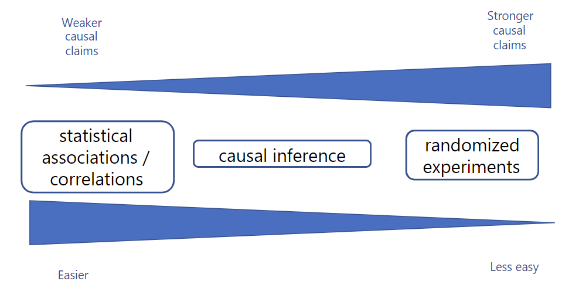
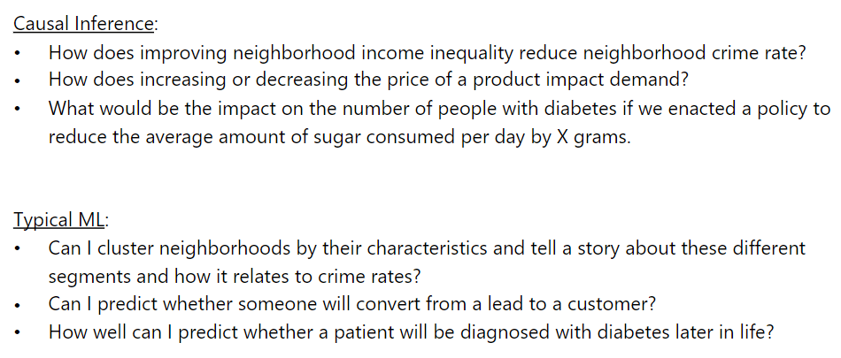
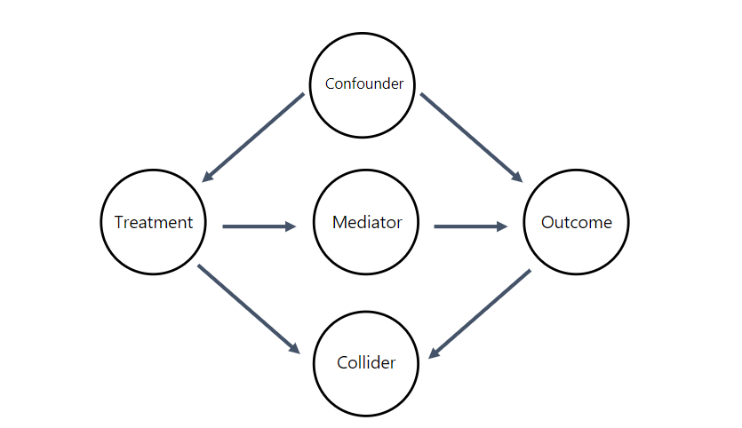

# Experiments
- Treatment Group - shown a special offer
- Control Group - Not shown a special offer

## Confounders
- We suspect treatment causes an action 
- Confounder is the cause that actually causes.

- We need to always control for confounders in inferential modeling
- Can flip the direction of your association of interest

## Colliders
- If you have a 3rd jointly caused by treatment and outcome
- Never control for/condition on colliders

- Collider bias

## Mediators
- It mediates relationship between treatment and outcome
- Controlling for a mediator will nullify associations of interest

